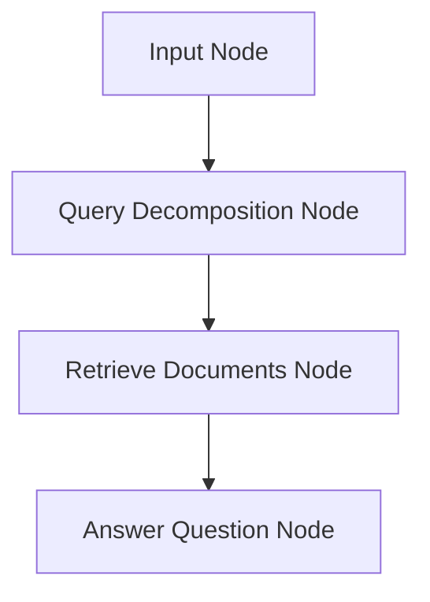

# Design Doc: AI Agent for Query Decomposition and Async Retrieval in Qdrant

> Please DON'T remove notes for AI

## Requirements

> Notes for AI: Keep it simple and clear.
> If the requirements are abstract, write concrete user stories

The system should implement an AI agent that performs query decomposition and asynchronous retrieval from Qdrant vector database.

User Stories:
- As a user, I want to input a complex question so that the system decomposes it into multiple simpler queries.
- As a user, I want the system to retrieve relevant documents asynchronously from Qdrant for each decomposed query, returning up to 4 points per query.
- As a user, I want the system to combine the retrieved context and generate a final answer to my original question.


## Flow Design

> Notes for AI:
> 1. Consider the design patterns of agent, map-reduce, rag, and workflow. Apply them if they fit.
> 2. Present a concise, high-level description of the workflow.

### Applicable Design Pattern:

1. RAG (Retrieval-Augmented Generation): Retrieve relevant documents from Qdrant to augment LLM responses.
2. Agentic Query Decomposition: Use LLM to break down complex queries into simpler sub-queries.
3. Async Workflow: Asynchronous retrieval for multiple queries to improve performance.

### Flow high-level Design:

1. **Input Node**: Capture the user's question.
2. **Query Decomposition Node**: Use LLM to plan and create multiple queries if needed.
3. **Retrieve Documents Node**: For each decomposed query, perform async retrieval from Qdrant, returning up to 4 points.
4. **Answer Question Node**: Combine the retrieved context and generate the final answer.


## Utility Functions

> Notes for AI:
> 1. Understand the utility function definition thoroughly by reviewing the doc.
> 2. Include only the necessary utility functions, based on nodes in the flow.

1. **Call LLM** (`utils/call_llm.py`)
   - *Input*: prompt (str)
   - *Output*: response (str)
   - Generally used by most nodes for LLM tasks

2. **Qdrant Client** (`utils/qdrant_client.py`)
   - *Input*: query (str), limit (int)
   - *Output*: list of retrieved points/documents
   - Used by the Retrieve Documents Node for async retrieval from Qdrant

## Node Design

### Shared Store

> Notes for AI: Try to minimize data redundancy

The shared store structure is organized as follows:

```python
shared = {
    "question": "User's original question",
    "decomposed_queries": ["query1", "query2", ...],
    "retrieved_contexts": [["point1", "point2", ...], ["point1", "point2", ...], ...],
    "answer": "Final answer"
}
```

### Node Steps

> Notes for AI: Carefully decide whether to use Batch/Async Node/Flow.

1. Input Node
  - *Purpose*: Capture the user's question
  - *Type*: Regular
  - *Steps*:
    - *prep*: None
    - *exec*: Get user input
    - *post*: Store question in shared

2. Query Decomposition Node
  - *Purpose*: Use LLM to decompose the question into multiple queries if needed
  - *Type*: Regular
  - *Steps*:
    - *prep*: Read question from shared
    - *exec*: Call LLM with decomposition prompt
    - *post*: Store decomposed queries in shared

3. Retrieve Documents Node
  - *Purpose*: Asynchronously retrieve documents from Qdrant for each query
  - *Type*: Async
  - *Steps*:
    - *prep*: Read decomposed queries from shared
    - *exec*: For each query, async retrieve up to 4 points from Qdrant
    - *post*: Store retrieved contexts in shared

4. Answer Question Node
  - *Purpose*: Combine retrieved contexts and generate final answer
  - *Type*: Regular
  - *Steps*:
    - *prep*: Read question and retrieved contexts from shared
    - *exec*: Call LLM with combined context
    - *post*: Store answer in shared

