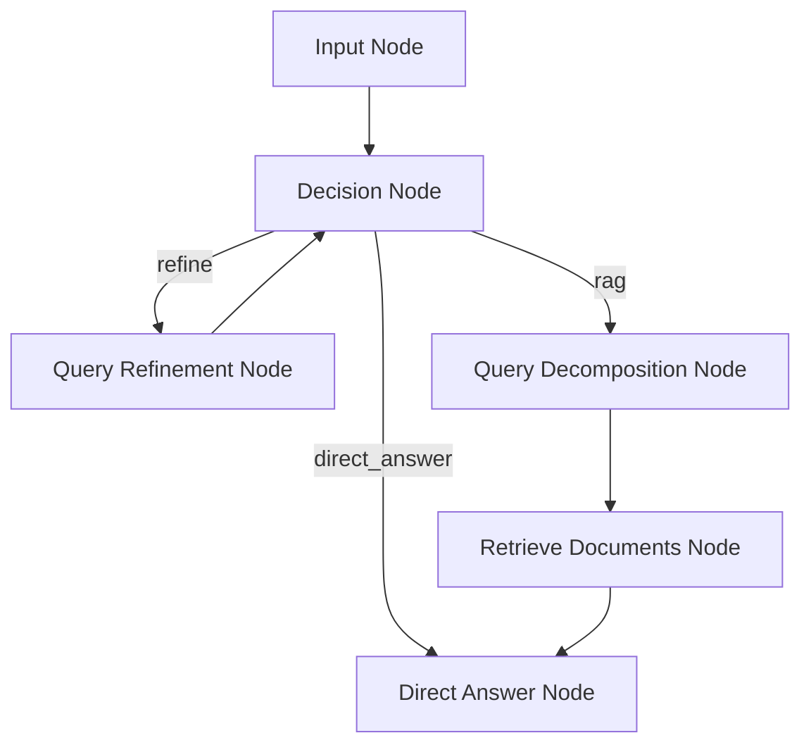
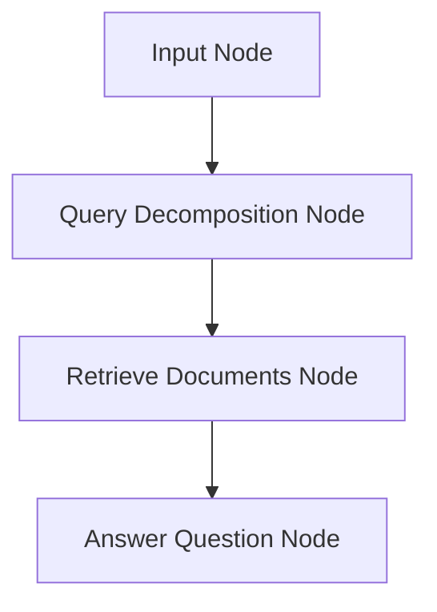

# Design Doc: AI Agent for Query Decomposition and Async Retrieval in Qdrant

> Please DON'T remove notes for AI

## Requirements

> Notes for AI: Keep it simple and clear.
> If the requirements are abstract, write concrete user stories

The system should implement an AI agent that performs query decomposition and asynchronous retrieval from Qdrant vector database, with conversation memory using Redis.

User Stories:
- As a user, I want to input a complex question so that the system decomposes it into multiple simpler queries.
- As a user, I want the system to retrieve relevant documents asynchronously from Qdrant for each decomposed query, returning up to 4 points per query.
- As a user, I want the system to combine the retrieved context and generate a final answer to my original question.
- As a user, I want the system to remember previous conversations so that it can provide context-aware responses using Redis for persistence.
- As a user, I want the system to intelligently decide whether to answer directly, refine the query, or use RAG based on the question's complexity and available context.


## Flow Design

> Notes for AI:
> 1. Consider the design patterns of agent, map-reduce, rag, and workflow. Apply them if they fit.
> 2. Present a concise, high-level description of the workflow.

### Applicable Design Pattern:

1. RAG (Retrieval-Augmented Generation): Retrieve relevant documents from Qdrant to augment LLM responses.
2. Agentic Query Decomposition: Use LLM to break down complex queries into simpler sub-queries.
3. Async Workflow: Asynchronous retrieval for multiple queries to improve performance.
4. Conversation Memory: Store and retrieve conversation history using Redis for context-aware responses.
5. Agent (ReAct Pattern): Decide whether to answer directly, refine query, or proceed to RAG based on context and question complexity.

### Flow high-level Design:

1. **Input Node**: Capture the user's question and load conversation history from Redis.
2. **Decision Node**: Analyze the question and history to decide: answer directly, refine query, or proceed to RAG.
3. **Query Refinement Node**: If refinement needed, generate a better query and loop back to decision.
4. **Query Decomposition Node**: Use LLM to plan and create multiple queries if needed, considering conversation history.
5. **Retrieve Documents Node**: For each decomposed query, perform async retrieval from Qdrant, returning up to 4 points.
6. **Answer Question Node**: Combine the retrieved context and generate the final answer, then save the conversation to Redis.







## Utility Functions

> Notes for AI:
> 1. Understand the utility function definition thoroughly by reviewing the doc.
> 2. Include only the necessary utility functions, based on nodes in the flow.

1. **Call LLM** (`utils/call_llm.py`)
   - *Input*: prompt (str)
   - *Output*: response (str)
   - Generally used by most nodes for LLM tasks

2. **Qdrant Client** (`utils/qdrant_client.py`)
   - *Input*: query (str), limit (int)
   - *Output*: list of retrieved points/documents
   - Used by the Retrieve Documents Node for async retrieval from Qdrant

3. **Memory Management** (`utils/memory.py`)
   - *Input*: user_id (str), message (dict) for save; user_id for load
   - *Output*: list of conversation messages for load; success for save
   - Used by Input and Answer nodes to load/save conversation history from/to Redis

## Node Design

### Shared Store

> Notes for AI: Try to minimize data redundancy

The shared store structure is organized as follows:

```python
```python
shared = {
    "user_id": "default_user",
    "question": "User's original question",
    "conversation_history": [{"role": "user", "content": "..."}, {"role": "assistant", "content": "..."}, ...],
    "decision": "direct_answer|refine|rag",
    "refined_question": "Refined question if applicable",
    "decomposed_queries": ["query1", "query2", ...],
    "retrieved_contexts": [["point1", "point2", ...], ["point1", "point2", ...], ...],
    "answer": "Final answer"
}
```
```

### Node Steps

> Notes for AI: Carefully decide whether to use Batch/Async Node/Flow.

1. Input Node
  - *Purpose*: Capture the user's question and load conversation history from Redis
  - *Type*: Regular
  - *Steps*:
    - *prep*: Load conversation history
    - *exec*: Get user input
    - *post*: Store question and history in shared

2. Decision Node
  - *Purpose*: Decide whether to answer directly, refine query, or proceed to RAG
  - *Type*: Regular
  - *Steps*:
    - *prep*: Read question and history from shared
    - *exec*: Call LLM to decide action
    - *post*: Store decision in shared and return action

3. Query Refinement Node
  - *Purpose*: Generate a better, more specific question
  - *Type*: Regular
  - *Steps*:
    - *prep*: Read question and history
    - *exec*: Call LLM to refine the question
    - *post*: Store refined question and return to decision

4. Query Decomposition Node
  - *Purpose*: Use LLM to decompose the question into multiple queries if needed, considering conversation history
  - *Type*: Regular
  - *Steps*:
    - *prep*: Read question and history from shared
    - *exec*: Call LLM with decomposition prompt including history
    - *post*: Store decomposed queries in shared

5. Retrieve Documents Node
  - *Purpose*: Asynchronously retrieve documents from Qdrant for each query
  - *Type*: Async
  - *Steps*:
    - *prep*: Read decomposed queries from shared
    - *exec*: For each query, async retrieve up to 4 points from Qdrant
    - *post*: Store retrieved contexts in shared

6. Answer Question Node
  - *Purpose*: Combine retrieved contexts and generate final answer, then save conversation to Redis
  - *Type*: Regular
  - *Steps*:
    - *prep*: Read question, history, and retrieved contexts from shared
    - *exec*: Call LLM with combined context and history
    - *post*: Store answer in shared and save conversation to Redis

